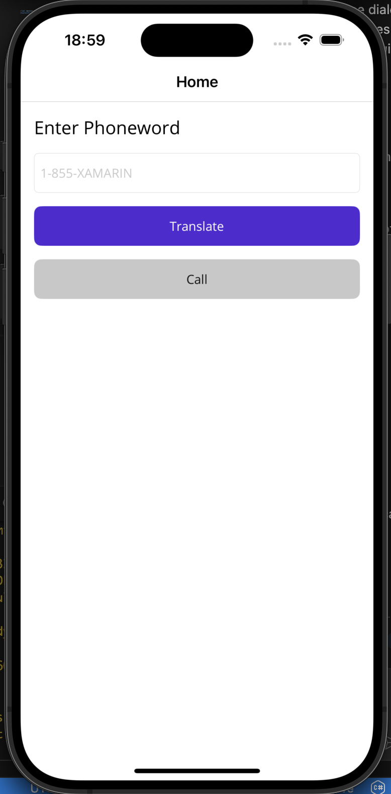

# Phoneword

A cross-platform mobile application built with .NET MAUI that converts phonewords (like 1-800-FLOWERS) into phone numbers and allows users to dial them directly.



## Features

- **Phoneword Translation**: Convert phonewords to actual phone numbers (e.g., "1-855-XAMARIN" → "1-855-926-2746")
- **Phone Dialing**: Direct integration with device phone dialer
- **Cross-Platform**: Runs on iOS, Android, macOS, and Windows
- **Material Design**: Clean and intuitive user interface

## How It Works

1. Enter a phoneword in the text field (e.g., "1-855-XAMARIN")
2. Tap the "Translate" button to convert it to a phone number
3. Tap the "Call" button to dial the number using your device's phone app

## Prerequisites

- .NET 9.0 or later
- Visual Studio 2022 17.8+ or Visual Studio Code with C# Dev Kit
- For iOS development: Xcode and iOS SDK
- For Android development: Android SDK

## Getting Started

1. **Clone the repository**
   ```bash
   git clone https://github.com/mphiliseni/Phoneword.git
   cd Phoneword
   ```

2. **Restore dependencies**
   ```bash
   dotnet restore
   ```

3. **Build the project**
   ```bash
   dotnet build
   ```

4. **Run the application**
   
   For Android:
   ```bash
   dotnet build -t:Run -f net9.0-android
   ```
   
   For iOS Simulator:
   ```bash
   dotnet build -t:Run -f net9.0-ios
   ```

## Project Structure

```
Phoneword/
├── MainPage.xaml              # Main UI layout
├── MainPage.xaml.cs           # UI code-behind and logic
├── PhonewordTranslator.cs     # Core translation logic
├── Platforms/                 # Platform-specific configurations
│   ├── Android/
│   │   └── AndroidManifest.xml
│   └── iOS/
│       └── Info.plist
└── Resources/                 # App resources (images, fonts, etc.)
```

## Permissions

### Android
The app requires the following permission in `AndroidManifest.xml`:
- `CALL_PHONE` - To initiate phone calls

### iOS
No special permissions required as iOS handles phone dialing through URL schemes.

## Technical Details

- **Framework**: .NET MAUI (Multi-platform App UI)
- **Target Frameworks**: 
  - net9.0-android
  - net9.0-ios
  - net9.0-maccatalyst
  - net9.0-windows (if needed)
- **Phone Dialer**: Uses `Microsoft.Maui.Essentials.PhoneDialer`

## Contributing

1. Fork the repository
2. Create a feature branch (`git checkout -b feature/amazing-feature`)
3. Commit your changes (`git commit -m 'Add some amazing feature'`)
4. Push to the branch (`git push origin feature/amazing-feature`)
5. Open a Pull Request

## License

This project is licensed under the MIT License - see the [LICENSE](LICENSE) file for details.

## Acknowledgments

- Built with [.NET MAUI](https://docs.microsoft.com/en-us/dotnet/maui/)
- Phone translation algorithm inspired by classic phone keypad mapping
- Part of mobile development learning exercises